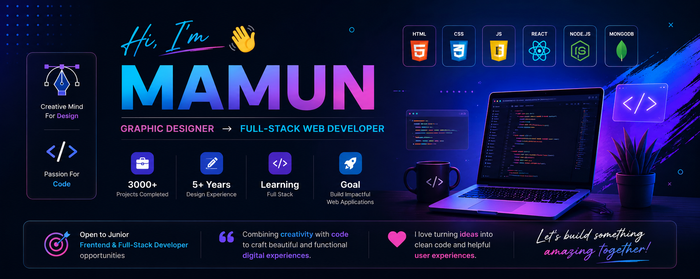

  

<h1 align="center">Hi, I'm Mamun</h1>

<h3 align="center">
💻 Full-Stack Web Developer • 🚀 Open to Junior Developer Opportunities
</h3>

---

# 👨‍💻 About Me

- 💻 **Full-Stack Web Development**
- 🌱 **React, Node.js, Express & MongoDB**
- 🚀 Open to **Junior Frontend Developer** and **Junior Full-Stack Developer** roles
- ❤️ Passionate about creating clean, modern, and user-friendly websites
- 🎯 Goal: Build high-quality web applications that combine beautiful design with clean code

---

# 🌐 Connect with Me

---

# 💻 Tech Stack

### 🌐 Frontend

### ⚙️ Backend

### 🛠 Tools

---

# 📚 Currently Learning

---

# 🚀 Featured Projects

| Project | Description |
|----------|-------------|
| 💰 **Freano** | Money Management App for Freelancers |
| 🌐 **Portfolio Website** | Personal Portfolio Website |
| 🍔 **Restaurant Website** | Responsive Restaurant Website |
| ⚛️ **React Projects** | React Practice Projects |
| 📖 **JavaScript Projects** | JavaScript Learning Journey |

---

# 📊 GitHub Stats

---

# 🔥 GitHub Streak

---

# 📈 Contribution Graph

---

# 🏆 GitHub Trophies

---

# 💡 Fun Facts

- 🎨 Designing professionally since **2020**
- 💻 Learning something new every day
- 🐧 Linux enthusiast
- ☕ Coffee + Code = Happiness
- 🚀 Future Full-Stack Engineer

---

# 👀 Profile Views

---

<h3 align="center">

⭐ Thanks for visiting my profile! ⭐

</h3>

<i>From designing brands for thousands of clients to building modern web applications — I'm combining creativity with code to create meaningful digital experiences.</i>

