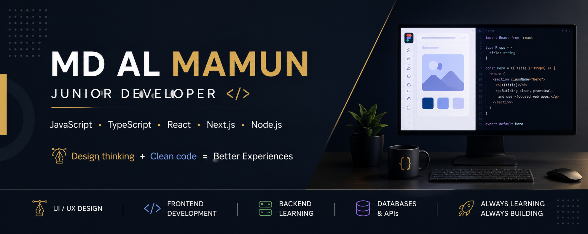

 

---

## 👋 About Me

I'm a **Junior Developer with 6 years of professional experience in graphic and UI design**.

After years of designing digital experiences for clients, I transitioned into software development and began turning my design experience into code. I now work primarily with **JavaScript, TypeScript, React, and modern frontend technologies**, while expanding my skills into backend and full-stack development.

I enjoy building interfaces that are not only visually polished, but also **responsive, accessible, maintainable, and functional**.

My design background gives me a strong understanding of **visual hierarchy, typography, spacing, branding, and user experience** — skills I bring into every application I build.

> **Design thinking + development skills = better digital experiences.**

---

## 🛠️ Tech Stack

### Frontend

### Backend & Database

### Tools & Design

---

## 🚀 Featured Projects

### 🍽️ Restaurant Menu Management System

A full-stack web application designed to help restaurants manage digital menus, including categories, menu items, pricing, and live editing.

**Built with:** `React` `TypeScript` `Tailwind CSS` `Node.js` `MongoDB` `REST API`

---

### 💰 Freano — Freelancer Finance Manager

A personal finance management application designed around the needs of freelancers, including income, expenses, and local payment workflows.

**Built with:** `React` `TypeScript` `Node.js` `MongoDB`

---

### 📊 Restaurant Finance Tracker

A finance tracking system for managing restaurant revenue and expenses with Google Sheets integration and Bangladesh-specific expense categories.

**Built with:** `Google Apps Script` `Google Sheets API` `Google OAuth`

---

## 💼 Experience

| Role | Organization | Period |
|---|---|---|
| **UI Designer** | Algorify Labs Ltd. | Oct 2025 – Mar 2026 |
| **Freelance Graphic Designer** | Fiverr · Level 2 Seller | 2020 – Present |

### Design Background

**6+ years of professional design experience**

- 3,000+ completed freelance projects
- Restaurant & hospitality menu design
- Brand identity & logo design
- UI design
- Print & digital design
- Client communication & project management

This professional design experience has given me a strong foundation in **visual hierarchy, typography, spacing, branding, and user-focused design** — skills I now apply directly to software development.

---

## 📚 Currently Learning

I'm continuously expanding my development skills and working toward becoming a well-rounded full-stack developer.

**Currently exploring:**

`Next.js` · `Node.js` · `Express.js` · `MongoDB` · `PostgreSQL` · `REST APIs` · `Authentication` · `Full-Stack Development`

I learn by building practical projects and solving real-world problems.

---

## 📈 GitHub Activity

---

## 🎯 Career Focus

I'm currently looking for opportunities as a:

**Junior Developer · Junior Frontend Developer · Junior React Developer**

I'm particularly interested in teams where I can combine my **professional design experience with modern development skills** to build meaningful products and continue growing as a developer.

---

### Let's build something great.

**Open to remote opportunities and collaborations.**

 

⭐ If you find something useful here, consider giving the repository a star.

